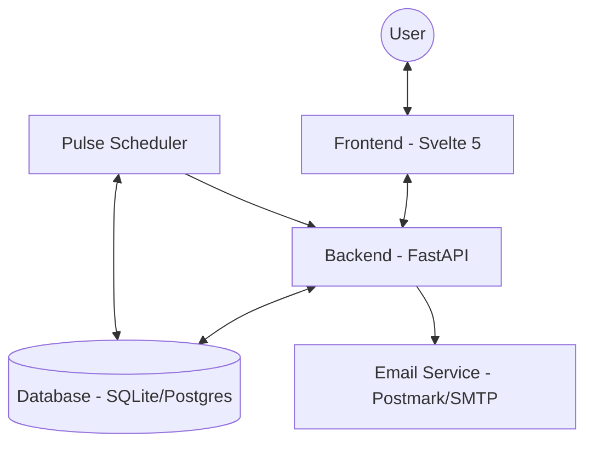

# System Architecture

Continuum is built as a modern full-stack web application with a focus on high availability, security, and structured data persistence.

## Tech Stack

| Component | Technology | Role |
| :--- | :--- | :--- |
| **Frontend** | Svelte 5 / Vite | Reactive UI and Client-side State |
| **Backend** | FastAPI | High-performance Python API |
| **Database** | SQLModel (SQLAlchemy) | ORM and Schema Management |
| **Auth** | WebAuthn + JWT | Biometric & Token-based Security |
| **Task Queue** | APScheduler | Periodic Pulse checks |

## System Components

## Core Modules

### 1. Authentication Layer
- **Passkeys (WebAuthn)**: Primary secure login method.
- **JWT**: Stateless session management.
- **Audit Logs**: Tracking login attempts and security events.

### 2. Pulse System
- **Check-ins**: Users confirm they are safe via magic links or manual entry.
- **Escalation Logic**: Tiered notification system (Guardians/Family) if check-ins are missed.
- **Safety Timer**: Immediate reach-out if a user doesn't cancel a timer (e.g., walking home).

### 3. Estate Data & Vault
- **Transparent Data**: Non-sensitive metadata accessible for AI Concierge assistance.
- **Encrypted Vault**: End-to-end encrypted storage for credentials and sensitive documents.

## Data Flow (Check-in)

1. **User** clicks check-in link in email.
2. **Backend** verifies token and records check-in.
3. **Database** updates `pulse_checkins` table.
4. **Scheduler** resets the next nudge time based on `pulse_settings`.
